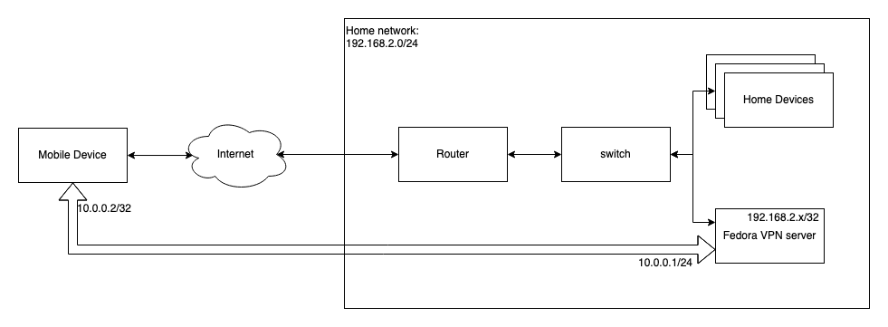

# Fedora Wireguard VPN

This document intends to create some documentation on my own experiences and thoughts regarding setting up a Wiregaurd VPN on a Fedora Server VM.
This project initially had three important goals:

1. being able to connect to my home network when I'm away from home
1. being able to encrypt all traffic on my mobile devices when I'm not connected to my home wifi, but connected to public/free wifi's or over 4G.
1. get acquainted with Wireguard VPN, as this is a new, but very promising and easy to use VPN solution

The solution doesn't intend to hide personal ip-addresses, but focusses only on encryption of all of the internet traffic, so that eavesdropping on public networks is prohibited. Also I don't take eavesdropping by the ISP into consideration, since my ISP providing my personal fiber-internet as my mobile 4G connection.

The solution I want to achieve is drafted in the following image:



## Setup

### Run as root

Al commands need to run as root user so I've switched user to root for the session.

```bash
sudo su -
```

### Install Wireguard tools

```bash
dnf install wireguard-tools
```

### Create Private/Public key

```bash
cd /etc/wireguard
umask 077
wg genkey > privatekey
wg pubkey < privatekey > publickey
wg genpsk > peer1presharedkey
```

### Create Server wireguard configuration

```ini
[Interface]
Address = 10.0.0.1/24
ListenPort = 51820
PrivateKey = <private-key-vpn-server>
PostUp = firewall-cmd --add-masquerade --zone FedoraServer
PostDown = firewall-cmd --remove-masquerade --zone FedoraServer

[Peer]
PublicKey = <public-key-peer-1>
PresharedKey = <preshared-key-peer-1>
AllowedIPs = 10.0.0.2/32

```

A thing to notice in this configuration is the `PostUp` and `PostDown` commands. In many articles on the internet you will find `ip-tables` configuration for SNAT/Masquerade settings in order to enable ip forwarding, but this will not work for Fedora Server. You need to use the firewalld commands in order to enable masquerading and succesfull routing of all the traffic to you local subnet and/or the internet.

### Enable IP forwarding
By default, the IPv4 and IPv6 policies in Fedora kernels disables support for IP forwarding. This prevents machines that run Fedora from functioning as dedicated edge routers. To enable IP forwarding, use the following commands: 

```bash
vi /etc/sysctl.d/99-sysctl.conf
```

add the following lines to the bottom of the file:

```ini
net.ipv4.ip_forward = 1
net.ipv6.conf.all.forwarding = 1
```

Save the file and exit. Run the following command

```bash
sysctl -p /etc/sysctl.conf
```

If the output looks like the following snippet ip-forwarding has been successfully enabled.

```bash
net.ipv4.ip_forward = 1
net.ipv6.conf.all.forwarding = 1
```

### Start the server

```bash
systemctl enable wg-quick@wg0.service
systemctl daemon-reload
systemctl start wg-quick@wg0
```

### Port forward on route

Create a port-forward on the router for port 51820 to the IP of the VPN server, so that you can reach your VPN server from the internet.

## Useful Links

- 